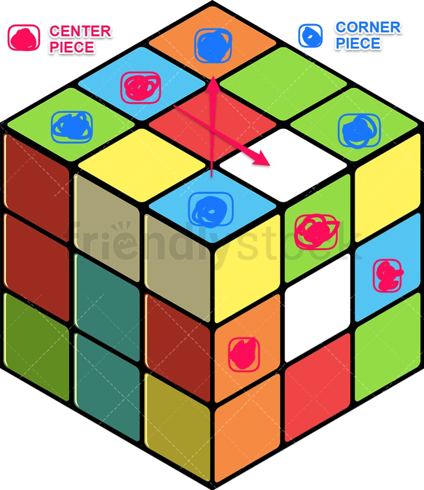

# rubik

Qiskit Hackathon Feb. 2021  
Team members: Michael, Jiseon, Shahid  

# Qiskit Hackathon  
## Friday the 12th, Saturday the 13th, and Sunday the 14th  
### Submit a project idea, Make a project, Present
#### Team name: CCNYseniors
##### Final roster: Michael, Jiseon, and Shahid
###### Lets do this!  
&nbsp;

&nbsp;

[hackerearth](https://www.hackerearth.com/challenges/hackathon/nyu-qiskit-hackathon/?utm_source=challenges-modern&utm_campaign=registered-challenges&utm_medium=right-panel)  
[Slack](https://app.slack.com/client/T01KBSUQSFK/G01M7PX8TG9)
&nbsp;

&nbsp;

&nbsp;

In order to use Qiskit, a user must do `pip3 install qiskit`.
&nbsp;

&nbsp;

Here is a summary of our project along with a diagram:  
3 by 3 by 3 Rubik's cubes are hard to solve for most people! What if there was a way to make it easier?  Using quantum superposition in our project, users can shift the placement of pieces. In this unique feature, users can shift the placement of any 2 center pieces with each other OR any 2 corner pieces with each other. Since qubits are probabilistic, switches aren't guaranteed. Using gates, however, we can shift probabilities toward our favor! Using this program, anyone who puts in enough effort will be able to solve the cube.
&nbsp;

Figure 1: Corner pieces and middle pieces are not the same

&nbsp;

Figure 2: Example frontend

